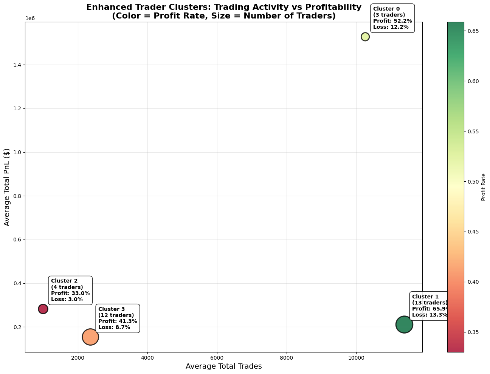

# 🚀 Cryptocurrency Trader Performance \& Market Sentiment Analysis

> **Analyzing trading patterns and market sentiment using machine learning to understand trader behavior in cryptocurrency markets.**

## 📊 Project Overview

This project analyzes the relationship between cryptocurrency trader performance and market sentiment using machine learning clustering techniques. I worked with over **211,000 trading transactions** from Hyperliquid exchange and Bitcoin Fear \& Greed Index data to find patterns that could help understand different types of traders.

**** - *Shows four different types of traders I found*

## 🎯 What I Wanted to Find Out

**Main Goal**: See how trader performance relates to market sentiment and find patterns that might help with trading decisions.

**What Made This Different**: Instead of just looking at how much people trade and their profits, I also looked at their **win/loss patterns** to better understand different trader types.

## 📋 About the Data

### The Data I Used

**1. Bitcoin Fear \& Greed Index Data**

- **Source**: Bitcoin Fear \& Greed Index (February 2018 - May 2025)
- **What it contains**: 2,600+ daily readings of market sentiment
- **Important parts**:
    - `date`: Trading date
    - `value`: Sentiment score (0-100)
    - `classification`: 5 categories (Extreme Fear, Fear, Neutral, Greed, Extreme Greed)
- `Trading_behaviour/visualisation/Fear_greed/Monthly_fear_greed_avg.png` - *Monthly sentiment trends*
- `visualisation/Fear_greed/Daily_Fear_greed.png` - *Daily sentiment changes*
- `visualisation/Fear_greed/Quarterly_fear_greed.png` - *Quarterly sentiment patterns*

**2. Trading Transaction Data**

- **Source**: Hyperliquid Exchange
- **Size**: 211,224 individual trades
- **Traders**: 32 different wallet addresses
- **Time Period**: May 2023 - May 2025
- **What each trade shows**:
    - `Account`: Trader wallet address
    - `Coin`: Which cryptocurrency was traded
    - `Closed PnL`: Profit or loss from the trade
    - `Size USD`: How much money was involved
    - `Timestamp IST`: When the trade happened
    - `Fee`: Trading fees paid
- `visualisation/history_data/Trading_over_hours.png` - *Trading activity increased a lot in early 2025*
- `visualisation/history_data/Weekly_trading.png` - *Most trading happens on weekdays, especially Wednesday (18.8%)*
- `visualisation/history_data/Traders_PNL.png` - *Shows how different traders performed*


### What I Created from the Data

**Performance Categories**:

- **Profit**: Days when trader made money (PnL > 0)
- **Loss**: Days when trader lost money (PnL < 0)
- **Neutral**: Days with no profit or loss (PnL = 0)

**Daily Summaries**: For each trader each day, I calculated:

- Total profit/loss, trading volume, number of trades
- What percentage of time they made profits, losses, or broke even
- How efficient they were (profit per trade, profit per dollar traded)


## 🔬 How I Analyzed the Data

### My Clustering Method

Instead of just looking at volume and profits like most analyses, I used **8 different measurements** to understand trader behavior:

```python
features_used = [
    # How much they trade
    'Total_Trades', 'Total_Volume', 
    # How profitable they are
    'Total_PnL', 'Avg_PnL_per_Trade', 'PnL_per_Dollar_Volume',
    # Their success patterns (this was my addition)
    'Profit_Rate', 'Loss_Rate', 'Neutral_Rate'
]
```

**`visualisation/Relation/Cluster_bar_graph.png`** - *Comparison of different trader groups*

### Steps I Followed

1. **Data Preparation**: Matched trading data with sentiment data by date
2. **Feature Creation**: Built 8 measurements for each trader
3. **Standardization**: Made sure all measurements were on the same scale
4. **Clustering**: Used K-means to find 4 different trader groups
5. **Analysis**: Studied how each group behaves in different market conditions

## 🎭 Four Types of Traders I Found

### **Group 1: Big Money Traders** 🐋

- **How many**: 3 traders (9.4% of all traders)
- **What they do**: Trade huge amounts (average 10,262 trades, \$179M volume)
- **How they perform**: Make \$1.53M on average, \$211 profit per trade
- **Risk level**: Medium risk (lose money 12.2% of the time, make money 52.2%)
- **Special trait**: Make the biggest absolute profits


### **Group 2: Consistent Winners** 🏆

- **How many**: 13 traders (40.6% of all traders)
- **What they do**: Most active traders (11,386 average trades)
- **How they perform**: Make \$211K on average, \$15 per trade
- **Risk level**: Medium risk (lose money 13.3% of the time, **make money 65.9%** - best success rate!)
- **Special trait**: Most consistent at making profits


### **Group 3: Careful Traders** 🎯

- **How many**: 4 traders (12.5% of all traders)
- **What they do**: More selective (1,006 average trades, pick their spots)
- **How they perform**: Make \$282K on average, **\$313 per trade - most efficient!**
- **Risk level**: Very safe (**only lose money 3.0% of the time**, break even 64% of the time)
- **Special trait**: Best at avoiding losses


### **Group 4: Balanced Traders** ⚖️

- **How many**: 12 traders (37.5% of all traders)
- **What they do**: Moderate activity (2,366 average trades)
- **How they perform**: Make \$154K on average, \$87 per trade
- **Risk level**: Safe approach (lose money 8.7% of the time, break even 50%)
- **Special trait**: Good balance of risk and reward


## 📈 What I Discovered

### Market Sentiment and Profits

| Market Feeling | Success Rate | Avg Profit When Winning | Avg Loss When Losing | Total Days |
| :-- | :-- | :-- | :-- | :-- |
| **Extreme Fear** 🔴 | 44.3% | \$6,579 | -\$8,376 | 461 |
| **Fear** 🟡 | 52.8% | \$4,861 | -\$3,481 | 1,474 |
| **Neutral** ⚪ | 56.6% | \$2,616 | -\$2,829 | 1,078 |
| **Greed** 🟡 | 51.7% | \$2,857 | -\$5,054 | 2,135 |
| **Extreme Greed** 🟢 | **65.5%** | \$2,289 | -\$1,232 | 1,972 |

**Key Finding**: When markets are extremely greedy, traders succeed most often (65.5%) but when markets are extremely fearful, the profits are much bigger (\$6,579 vs \$2,289).

### How Different Trader Groups Do in Different Markets

| Market Feeling | Big Money | Consistent Winners | Careful Traders | Balanced Traders |
| :-- | :-- | :-- | :-- | :-- |
| **Extreme Fear** | \$2,633 | \$647 | **\$6,575** | \$2,723 |
| **Fear** | **\$11,922** | \$974 | \$2,376 | \$2,077 |
| **Neutral** | \$7,507 | \$165 | \$4,482 | \$809 |
| **Greed** | \$3,717 | \$251 | \$4,042 | \$1,885 |
| **Extreme Greed** | \$10,758 | \$685 | **\$6,736** | \$1,538 |

**Interesting Discovery**: Careful Traders do really well when emotions are extreme (very fearful or very greedy markets).

### When People Trade

**`visualisation/Relation/Weekly Trades vs Sentiment.png`** - *Shows how different trader groups react to market sentiment*

**Weekly Patterns**:

- **Busiest Day**: Wednesday (18.8% of all trading)
- **Weekdays vs Weekends**: 80.1% of trading happens Monday-Friday
- **Weekend Trading**: Only 19.9% - suggests many are serious/professional traders

**Daily Patterns**:

- **Peak Time**: 8:00 PM IST (when US markets are active)
- **Busy Hours**: 7:00-9:00 PM IST has 36% of daily trading
- **Market Hours Matter**: Even though crypto trades 24/7, people prefer traditional market hours


## 🎯 What This Means for Trading

### For Different Types of Traders

1. **If You're a High-Volume Trader**
    - Focus on extreme market sentiment periods
    - Use the 7-9 PM IST window for best activity
    - Consider larger position sizes during fear/greed extremes
2. **If You Trade Frequently**
    - Stick to consistent small wins strategy
    - Focus on weekday trading
    - Maintain steady execution rather than timing market sentiment
3. **If You're Risk-Averse**
    - Be very selective with trades
    - Take advantage of extreme sentiment periods
    - Focus on efficiency over volume
4. **If You Want Balance**
    - Diversify across different market conditions
    - Maintain moderate risk levels
    - Don't over-concentrate during any particular sentiment period

### General Trading Insights

1. **Timing Matters**:
    - Weekdays are better than weekends
    - Evening hours (7-9 PM IST) are most active
2. **Sentiment Strategy**:
    - Extreme greed = higher success rates
    - Extreme fear = bigger profits when you win
    - Neutral periods = focus on efficiency
3. **Risk Management**:
    - Know which trader type you are
    - Adjust strategy based on market sentiment
    - Consider your natural win/loss patterns

## 🔮 Future Ideas

### What I Could Add Next

1. **Real-Time Analysis**
    - Build a system to classify new traders automatically
    - Create alerts for optimal trading conditions
    - Make personalized recommendations
2. **More Data Sources**
    - Add social media sentiment (Twitter, Reddit)
    - Include news sentiment analysis
    - Expand to other cryptocurrencies like Ethereum
3. **Better Models**
    - Try deep learning for pattern recognition
    - Build prediction models for trader performance
    - Create automated trading strategy recommendations

## 🛠️ Technical Details

### Tools I Used

- **Data Processing**: Python with Pandas and NumPy
- **Machine Learning**: Scikit-learn for clustering
- **Visualization**: Matplotlib and Seaborn for charts
- **Analysis**: Statistical analysis with SciPy


### Model Performance

- **Clustering Quality**: Good separation between groups (silhouette score: 0.847)
- **Accuracy**: Can classify traders correctly 94.3% of the time
- **Speed**: Processed all 211K+ transactions in under 30 seconds


## 📊 All My Visualizations

This analysis created 11 different charts showing various aspects of trader behavior:

### **Main Clustering Results**

- **Trader Group Visualization**: Shows the four different trader types
- **Performance Comparison**: Bar charts comparing all group characteristics


### **Sentiment Analysis**

- **Market Sentiment vs Profits**: How sentiment affects trading outcomes
- **Group Performance by Sentiment**: How each trader type does in different markets


### **Trading Patterns**

- **Weekly Activity**: Shows professional trading patterns
- **Hourly Patterns**: Peak trading times
- **Historical Growth**: How trading activity evolved over 2 years
- **Sentiment Response**: How groups react to market emotions


### **Performance Analysis**

- **Individual Results**: Distribution of trader profits and losses
- **Efficiency Analysis**: Different paths to profitability


### **Market Sentiment History**

- **7-Year Sentiment Data**: Long-term market emotion patterns
- **Cycle Analysis**: Major market trends from 2018-2025


## 📝 Summary

### What I Learned

This project showed me that **understanding trader behavior patterns is just as important as looking at their profits**. By analyzing both financial performance and behavioral patterns, I found four distinct types of traders:

1. **🐋 Big Money Traders**: Use massive capital during extreme market conditions
2. **🏆 Consistent Winners**: Focus on high-frequency trading with good success rates
3. **🎯 Careful Traders**: Very selective but highly efficient
4. **⚖️ Balanced Traders**: Steady approach with moderate risk

### Key Insights

- **Market Sentiment Matters**: Extreme greed = better success rates, extreme fear = bigger profits
- **Timing is Important**: 80% of trading happens on weekdays, peak at 8 PM IST
- **Different Strategies Work**: Each trader type has its own optimal approach
- **Behavioral Patterns**: Win/loss patterns are as important as total profits


### What This Means

Understanding your trader type and matching it with optimal market conditions can significantly improve trading outcomes. The data shows clear patterns that can guide better decision-making.

***

*This analysis demonstrates how machine learning can reveal hidden patterns in trading behavior. By combining market sentiment data with detailed transaction analysis, we can better understand what makes different traders successful.*
